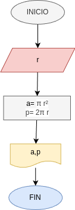

# Programa 1: area_perimetro_circulo
programa en python calcular el área y el perímetro de un circulo, dado el valor de su angulo 

## Ánalisis

### Variables de entrada
- r: radio del circulo 

### Procesamiento 
- a: area del circulo
- p: perimetro del circulo

$a= \pi * r$

$p= 2*\pi*r$

## Diseño

## Construcccion 
codigo implementado en archivo area_perimetro_circulo.py
